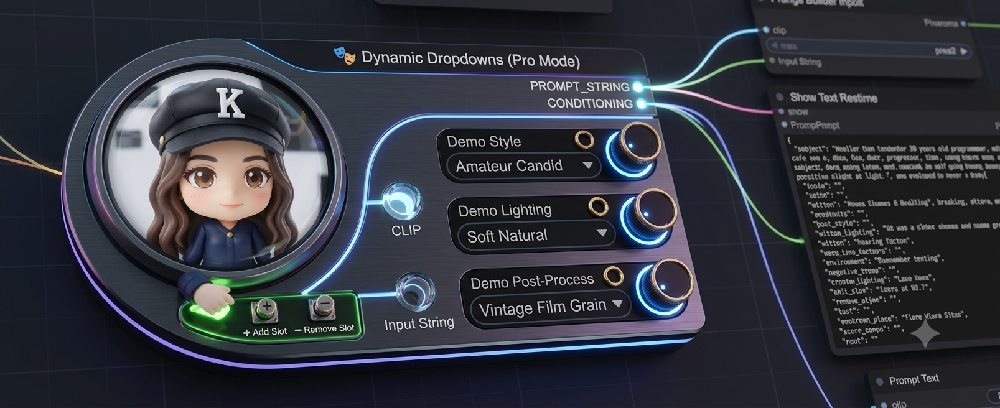

# 🎭 ComfyUI Dynamic Dropdowns & Assistant



A self-contained, high-efficiency custom node system and Windows desktop companion app for ComfyUI. This tool eliminates canvas clutter by consolidating multiple text attribute dropdowns (e.g., hair lengths, colors, styles, outfits, lighting) into a single, cohesive comma-separated output block—serving it simultaneously as a raw string and an encoded conditioning prompt.

---

## ✨ Features

* **📦 100% Self-Contained Architecture:** No messy global asset paths. The custom node scans its own local `lists/` subfolder, ensuring absolute portability. If you copy the node folder to another machine, it works instantly.
* **🧠 Dual Prompt Injection Engine:** Outputs both a raw `STRING` (for prompt text stacking/debugging) and a pre-tokenized `CONDITIONING` block (to wire directly into KSampler slots, bypassing separate Text Encode nodes).
* **💻 Desktop Companion Utility (`Node Builder Assistant.exe`):** A zero-dependency, hardware-accelerated Windows UI tool that lets you visually build, update, and manage your custom node structures offline without writing a single line of Python.
* **🧼 Automatic Formatting & Cleaning:** The node backend strips out double quotes (`"`), trailing backslashes (`\`), empty rows, and handles string concatenation automatically, preventing messy trailing commas in your generation prompts.

---

## 📂 Repository Architecture

When properly deployed, your project folder maintains this modular layout:

```text
ComfyUI-Dynamic-Dropdowns/
├── Node Builder Assistant.exe   # Standalone node generator app
├── __init__.py                  # The active ComfyUI custom node script
├── README.md                    # Project documentation
├── .gitignore                   # Dev exclusion rules
├── lists/                       # Put your choice text assets here!
│   ├── hair_length.txt
│   ├── hair_color.txt
│   └── hairstyle.txt
└── generator/                   # Companion App source folder (for updates)
    ├── app.py                   # PyWebView window engine wrapper
    ├── generator.html           # Desktop interface panel
    ├── requirements.txt         # Dev build dependencies
    └── build.py                 # Isolated one-click .exe compiler
```
---

## ⚙️ Installation Guide

### Standard User Quick Start
1. Clone this repository directly into your ComfyUI nodes directory:
   ```bash
   git clone [https://github.com/0velia/ComfyUI-Dynamic-Dropdowns.git](https://github.com/0velia/ComfyUI-Dynamic-Dropdowns.git)
    ```

Launch or restart ComfyUI. A 🎭 Dynamic Dropdowns (Demo Mode) node will immediately be available on your canvas to show you how the pipeline routes text choices.

🛠️ Customizing and Building Your Own Nodes
Once you see how the demo works, you can build your own fully customized menu layouts:

Open the repository folder and double-click Node Builder Assistant.exe.

Design your custom dropdown panels and match them to your own text files inside the lists/ folder.

Click Build Custom Node, download the new code, and save it as __init__.py to overwrite the demo placeholder!

---

## 🚀 How to Use

### 1. Generating or Updating Nodes via the Companion App
If you want to configure what dropdown columns display inside ComfyUI:
1. Double-click **`Node Builder Assistant.exe`** right in the root directory.
2. Click **+ Add Dropdown Menu** for each menu attribute slot you wish to manage.
3. Assign the text label name (e.g., `hair_color`) and match it exactly to the `.txt` file name located inside your `lists/` folder.
4. Click **Build Custom Node** to generate the node logic.
5. Click **Download Code**, save the file, and name it exactly **`__init__.py`**, replacing the existing script in the root folder.

### 2. Canvas Workflow Mapping (Daisy-Chaining)
Thanks to the optional input stacking architecture, you can link multiple dynamic dropdown nodes sequentially to keep your canvas beautifully organized:

1. **Add Node 1 (e.g., Character Attributes):** Leave `input_string` empty. Select your core details (e.g., hair, clothing).
2. **Add Node 2 (e.g., Environment & Framing):** Connect the `PROMPT_STRING` output from Node 1 directly into the `input_string` slot of Node 2.
3. **Connect Pipeline Engines:** Wire your checkpoint's `CLIP` output directly into Node 2's `clip` slot. 
4. **Final Delivery:** Route Node 2's `CONDITIONING` dot directly into your KSampler. The backend seamlessly combines the outputs (`character traits, framing choices, lighting styles`) into a single comma-separated string without duplicate punctuation artifacts, even if inputs are left unlinked.

---

## 🛠️ Developer / Compilation Setup
If you want to modify the companion app layout styles or tweak the core source generation engine:
1. Make your code alterations inside `generator/generator.html` or `generator/app.py`.
2. Open your command terminal inside the `/generator` folder and execute the one-click compilation automator script:
   python build.py
   
This script dynamically sets up an isolated Python virtual environment, installs the compression assets, strips module bloat, compiles the new optimized binary, moves it directly to the root path as `Node Builder Assistant.exe`, and purges temporary cache files automatically.
